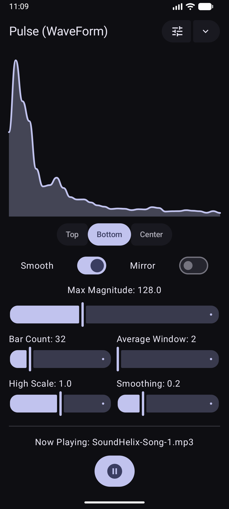
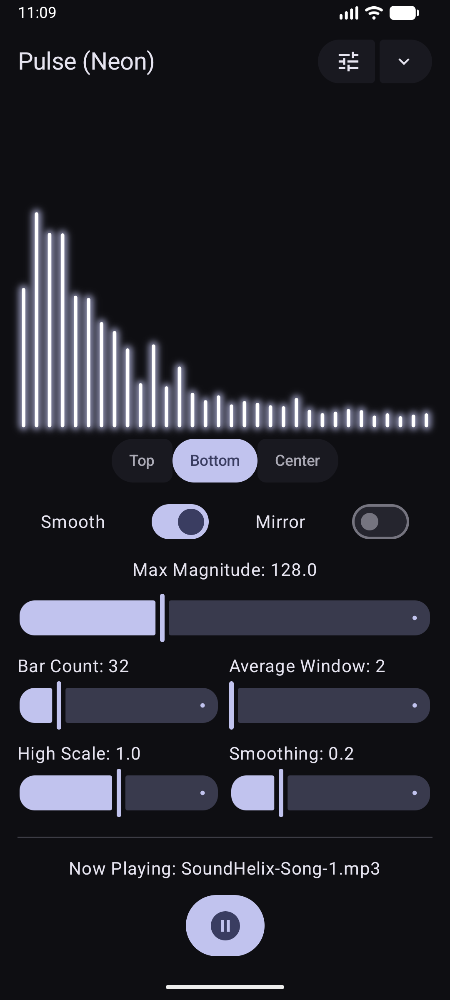
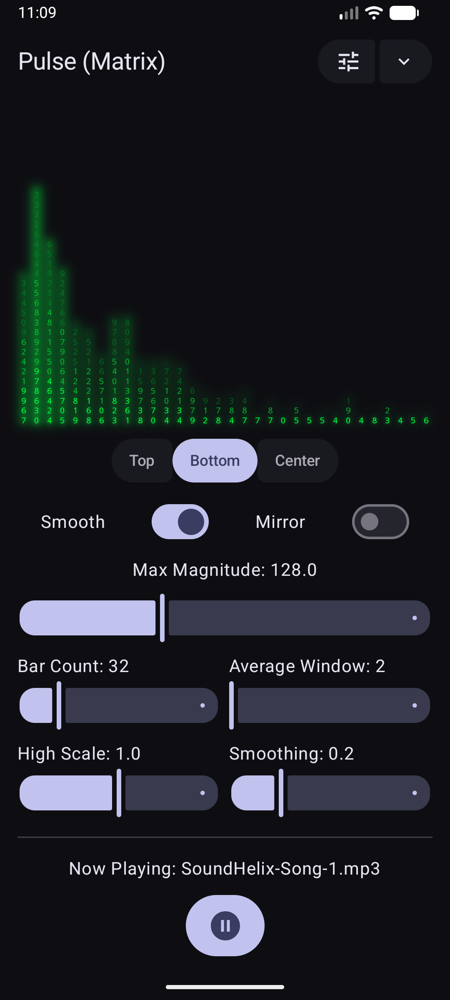
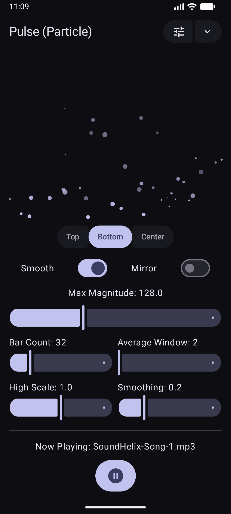
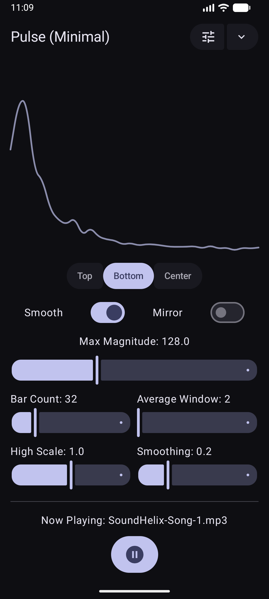
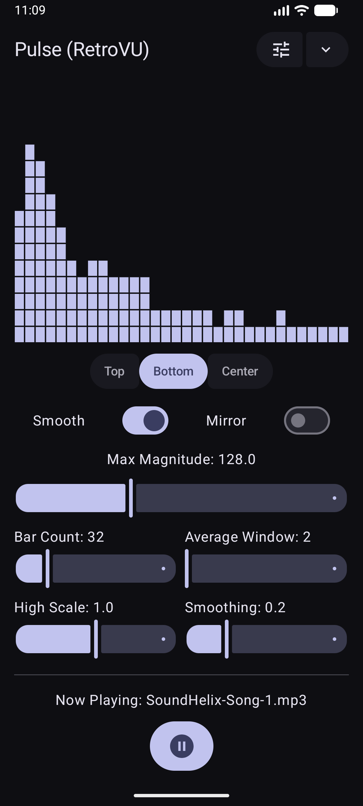
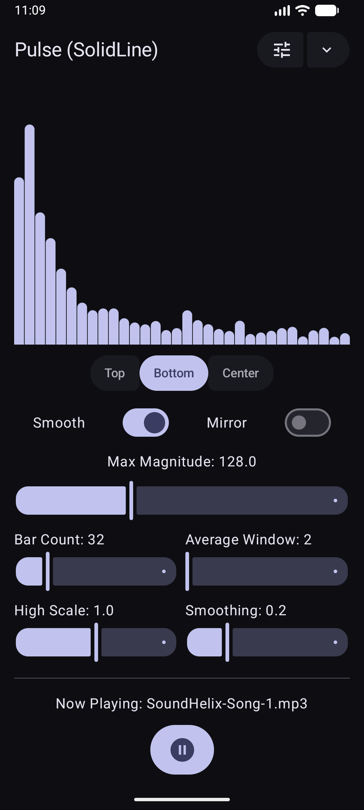
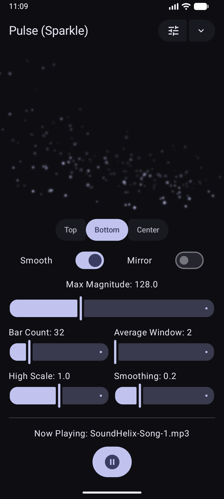
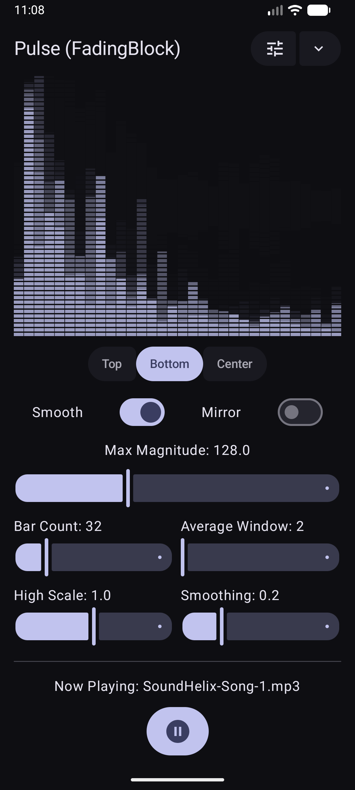

<div align="center">

# 🎵 Pulse Compose

[](https://search.maven.org/search?q=g:%22io.github.otangid%22%20AND%20a:%22PulseCompose%22)
[](LICENSE)
[](https://www.android.com)

**A high-performance, highly customizable audio visualizer library for Jetpack Compose.**

[Explore Example App](app/src/main/java/otang/id/lib/pulse/example/MainActivity.kt) • [Report Bug](https://github.com/otangid/PulseCompose/issues) • [Request Feature](https://github.com/otangid/PulseCompose/issues)

</div>

---

## ✨ Preview Gallery

|                Wave Form                |                Neon                |                   Matrix                    |
|:---------------------------------------:|:----------------------------------:|:-------------------------------------------:|
|    |        |             |
|              **Particle**               |            **Minimal**             |                **Retro VU**                 |
|     |  |          |
|             **Solid Line**              |            **Sparkle**             |              **Fading Block**               |
|  |  |  |

---

## 🚀 Features

- 🎨 **9 Unique Rendering Styles**: From classic WaveForms to cyber Matrix effects.
- ⚡ **High Performance**: Optimized for 60fps rendering using Native Canvas & Compose.
- 🛠️ **Deep Customization**: Control physics, colors, gravity, and smoothing.
- 🌊 **SMA Smoothing**: Built-in Simple Moving Average to eliminate FFT jitter.
- 🌗 **Adaptive Design**: Supports Top, Bottom, and Symmetric (Mirror) gravity.
- 🔄 **Auto-Lifecycle**: Managed Visualizer lifecycle with Compose `DisposableEffect`.

---

## 📦 Installation

Add the dependency to your `build.gradle.kts`:

```kotlin
dependencies {
    implementation("io.github.otangid:PulseCompose:$version")
}
```

---

## 🛠️ Quick Start

1. **Permissions**: Add `RECORD_AUDIO` to your `AndroidManifest.xml`.
   ```xml
   <uses-permission android:name="android.permission.RECORD_AUDIO" />
   ```

2. **Implementation**:
   ```kotlin
   PulseView(
       audioSessionId = mediaPlayer.audioSessionId,
       modifier = Modifier.fillMaxWidth().height(240.dp),
       config = PulseConfig(
           renderer = PulseRenderer.Neon,
           barColor = Color.Magenta,
           mirror = true // Bass in the center!
       )
   )
   ```

---

## 📖 Configuration Documentation

`PulseConfig` allows you to customize the behavior and appearance of all visualizers.

### 1. Global Configuration

| Parameter                 | Function                             | Recommended Range | Notes                                                                                                           |
|:--------------------------|:-------------------------------------|:------------------|:----------------------------------------------------------------------------------------------------------------|
| `renderer`                | Selects the visualizer style.        | -                 | Options: `WaveForm`, `Neon`, `Matrix`, `Particle`, `Minimal`, `RetroVU`, `SolidLine`, `Sparkle`, `FadingBlock`. |
| `gravity`                 | Sets the growth direction/baseline.  | -                 | `Bottom` (upwards), `Top` (downwards), `Center` (mirrored expansion).                                           |
| `barColor`                | Primary color.                       | -                 | Defaults to `MaterialTheme.colorScheme.primary` if null.                                                        |
| `barCount`                | Number of bars or data points.       | **16 - 128**      | Higher counts (>128) may impact performance on older devices.                                                   |
| `maxMagnitude`            | Divisor for FFT normalization.       | **64 - 255**      | Default `128`. Lower values make the visualizer more sensitive (taller).                                        |
| `heightScale`             | Final height multiplier.             | **0.5 - 1.5**     | `1.0` fills the container height.                                                                               |
| `smoothing`               | Height transition speed (EMA).       | **0.1 - 0.5**     | `0.1` (very smooth), `0.5` (very reactive/aggressive).                                                          |
| `useMovingAverage`        | Enables Simple Moving Average (SMA). | `true/false`      | Effectively removes excessive FFT jitter.                                                                       |
| `movingAverageWindowSize` | Number of frames for SMA.            | **2 - 8**         | Default `2`. Higher values add "weight" and delay to movements.                                                 |
| `mirror`                  | Symmetrical Bass-to-Center mode.     | `true/false`      | Provides a professional, balanced aesthetic.                                                                    |

---

### 2. Renderer Specific Configurations

#### **FadingBlockConfig**

| Parameter         | Function                           | Recommended Value |
|:------------------|:-----------------------------------|:------------------|
| `barGapPx`        | Horizontal gap between bars.       | **2 - 10**        |
| `filledBlockSize` | Length of the drawn dash segments. | **5 - 20**        |
| `emptyBlockSize`  | Gap between dash segments.         | **2 - 10**        |
| `fadeAlpha`       | Speed of the trail decay.          | **150 - 230**     |

#### **MatrixConfig**

| Parameter        | Function                               | Recommended Value |
|:-----------------|:---------------------------------------|:------------------|
| `barGapPx`       | Horizontal gap between Matrix columns. | **2 - 8**         |
| `glowAlpha`      | Alpha of the glow behind characters.   | **100 - 255**     |
| `changeInterval` | Text randomization speed (in frames).  | **1 - 10**        |

#### **MinimalConfig**

| Parameter          | Function                       | Recommended Value |
|:-------------------|:-------------------------------|:------------------|
| `strokeWidthScale` | Thickness of the minimal line. | **1.0 - 5.0**     |
| `alpha`            | Transparency of the line.      | **0.3 - 1.0**     |

#### **NeonConfig**

| Parameter    | Function                              | Recommended Value |
|:-------------|:--------------------------------------|:------------------|
| `barGapPx`   | Horizontal gap between neon tubes.    | **2 - 12**        |
| `glowRadius` | Blur radius for the neon glow effect. | **8 - 25**        |
| `glowAlpha`  | Intensity of the neon glow.           | **100 - 200**     |

#### **ParticleConfig**

| Parameter      | Function                              | Recommended Value |
|:---------------|:--------------------------------------|:------------------|
| `maxParticles` | Maximum particles on screen.          | **100 - 500**     |
| `decayRate`    | Particle lifecycle speed.             | **0.005 - 0.03**  |
| `audioGate`    | Threshold to trigger particle bursts. | **0.02 - 0.1**    |

#### **RetroVUConfig**

| Parameter      | Function                   | Recommended Value |
|:---------------|:---------------------------|:------------------|
| `segmentCount` | Vertical segments per bar. | **8 - 32**        |
| `segmentGapPx` | Gap between segments.      | **2 - 6**         |

#### **SolidLineConfig**

| Parameter              | Function                         | Recommended Value |
|:-----------------------|:---------------------------------|:------------------|
| `isRoundedBarsEnabled` | Enables rounded corners on bars. | `true/false`      |
| `cornerRadius`         | Corner radius for bars.          | **4 - 50**        |

#### **SparkleConfig**

| Parameter      | Function                          | Recommended Value |
|:---------------|:----------------------------------|:------------------|
| `sparkleCount` | Maximum sparkles on screen.       | **100 - 500**     |
| `glowRadius`   | Blur radius for the sparkle glow. | **2 - 10**        |

#### **WaveFormConfig**

| Parameter          | Function                          | Recommended Value |
|:-------------------|:----------------------------------|:------------------|
| `showFill`         | Toggles area fill under the wave. | `true/false`      |
| `fillAlpha`        | Transparency of the fill.         | **0.1 - 0.5**     |
| `strokeWidthScale` | Thickness of the waveform line.   | **2.0 - 6.0**     |

---

### 💡 Optimization Tips

- **Performance**: If you notice lag, reduce `barCount` and `maxParticles`.
- **Smoothness**: For the cleanest look, use `useMovingAverage = true` and `smoothing = 0.2f`.
- **Sensitivity**: If the visualizer is too short, decrease `maxMagnitude` or increase `heightScale`.

---

## 🤝 Contributing

Contributions are welcome! If you have a new renderer idea or a performance fix, feel free to open a PR.

## 📄 License

This project is licensed under the MIT License.
